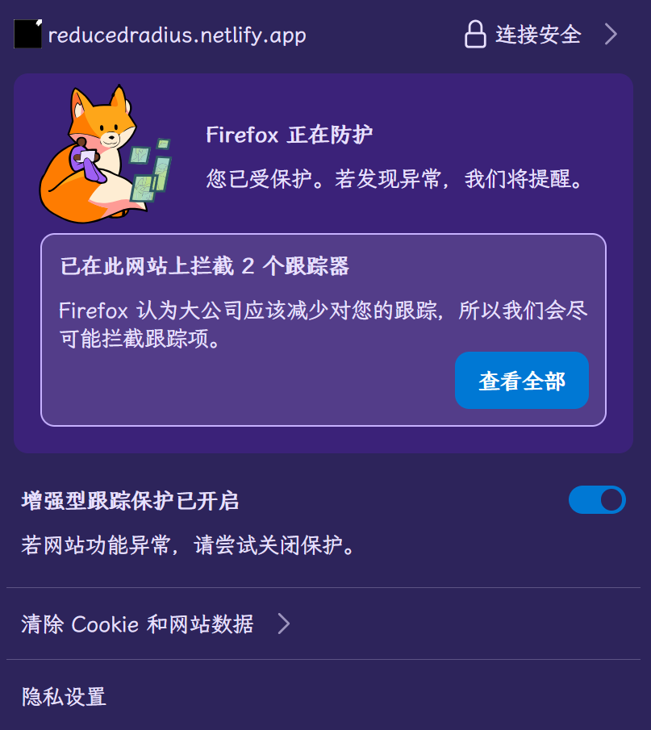

# 帮助与说明

## 注意事项
!> 本页面**不是**v86的官方页面，若您认错了，请前往 https://copy.sh/v86/ ；
!> 本页面**不是**模拟系统的万金油，亦存在OS/2 2.0等较古老操作系统无法运行。要运行，请使用本地虚拟化软件继续。
!> 由于运行cpu为单核，运行速度极慢;放大时仅用于图形界面，不适用于命令行界面。

##  说明

本页面上次修改于2026.9.21，by ReducedRadius(https://github.com/flytothehighest) <br />
另请不要在网页未加载完毕时点击按钮，否则会发生报错。<br />
已知难以修复的bug:
 https://github.com/copy/v86/issues/1556 ：无法使用大容量光盘映像文件，否则无法识别或识别错误。
 直至现在，本页面依然有许多bug，敬请谅解。
如果您不喜欢本页的字体(｡•́︿•̀｡)，请点击
<a href="/fonts/index.html">此处</a>修改

一不小心发现的：`github.com/hellopgrmm` 也做了类似的“威86”，用的是同一个库,也用了minivmac，但其在2026年7月12日才提交初版（add vm,https://github.com/hellopgrmm/hellopgrmm.github.io/commit/c036da11de2f95798462c0dbd483c8853afc5db1 ）,而本页早在2023.6就处于编写阶段。<br />声明：本作者与该页面的作者间无任何联系。本页作者既不推崇又不反对您使用ta的页面。（简而言之，只是提提而已）
<br />


## 注意⚠️

1. 本虚拟机**不能运行**64位系统；（32位的2038年1月后时间系统将错乱,本页面将成为历史）
2. 运行内存不应超过2GiB；

3. 因为浏览器的wasm支持尚存局限，运行速度慢，请耐心等待。
4. 某自研操作系统的品牌手机之官方浏览器会认为本站为风险网站，但火狐浏览器(如下图所示)，Edge等均未检出任何风险。(除去www.clarity.ms 以及 https://c.clarity.ms 这两个"跟踪器“以外)对此本人只能感慨某品牌系统的“安全性”太无敌了。您可以自行、任意清理本网页存储的Cookie，均不影响本页面使用。


<br />



## V1.7.0（2026.9）
经大量用户使用观察，发现bug：**自定义虚拟机无法启动。**
重要bug修复：自定义虚拟机因`"0"`,`0`不分出现bug,另外<del>愚蠢的</del>作者把buffer与`String`弄混,均在9.5得到修复; <br />
另限制ISO大小至1,024MiB，超过该大小的ISO统一不接受<br />
添加反馈系统;<br />
放大倍数最大值限制在3x；<br />
据 https://github.com/copy/v86/blob/master/v86.d.ts (类型定义），增添了一些自定义虚拟机的启动参数。<br />
添加Mac7的AfterDark（屏幕保护程序）。<br />
此外作者的部分表述混淆了GiB与GB，现已更正。<br />
修复了v86更新时的disk_image读取错误,暂时回退至仅读取软盘。<br />
boxedwine全屏修复;(改版不完全所致)<br />

## V1.6.4（2026.8）
更新部分虚拟机内容（v86,boxedwine），添加ZX Spectrum模拟器;

## V1.6.3(2025.12.13)
增加动不动就崩溃的BOXEDWINE;

## V1.6.2
1. 对部分虚拟机(命令行界面(CLI,Command Line Interface)系统除外)无法缩放进行修复；
2. 增加软盘2操作（弹出，换盘）；
3. 增加虚拟机驱动器信息查看。

## V1.6.1
1. 添加弹出插入音效；
2. 增加两个古早游戏的网页模拟版本及其部分说明书。

## v1.6 修改内容
1. 增加CD-ROM弹出与更换；
2. 增加软盘1弹出；
3. 为保证音响效果，mac6/7需要点击一次虚拟机才可开机。


## “网页虚拟机”与网页模拟器 概念澄清
  本页所谓虚拟机，是使用WebAssembly制作的系统真实运行页面（须模拟扬声器（speaker），CPU,ACPI，内存等等）,例如 https://www.pcjs.org/ , https://copy.sh/v86/ ；
  而所谓模拟器例如：https://win11.blueedge.me/ , https://win12.tech （此屑作者贡献了2次） 等为重构像原先系统的页面（使用React，tailwind CSS等模仿）；<br />
  也有二者皆有的，如 https://anura.pro/ ;
  此处所谓虚拟机并非离线专业应用完美,例如Windows只能最多达[Windows 8 Build 8133 32 Bit](https://github.com/copy/v86/issues/852#issuecomment-1537372962),且不能为64位（因为是x86架构）

## 存储镜像须知

本页面所用镜像(.iso,.img等)均来自互联网；

## V86网页虚拟机基本帮助

### 驱动器管理
已完全实现。


### 按钮
 **注意：保存存档后，只能在同一虚拟机中加载存档**
重启：将虚拟机硬重启，因此可能打开不了；<br />
暂停/继续：暂时/继续对虚拟机的运转；<br />
全屏使用：显示时只保留虚拟机显示内容；<br />
按下回车：方便部分移动用户而设的一个按钮；<br />
Ctrl-Alt-Del 组合键：引出特殊功能或重启的组合键，不同系统效果不同；<br />
放大倍数：对模拟显示器放大的倍数；<br />
键入字符框：键入0-9,a-z的有效字符<br />
保存/加载状态： 用“state.bin”文件保存以备加载；注意：保存状态与还原状态的2个虚拟机**所有配置应该一致，包括驱动器，RAM，显存；否则会引起恢复错误！** <br />
键入键盘代码框：代码内容对应[见下表](#附录键盘代码keycode参考值)：
(例如实现回车：输入14，按下键入即可)


### 注意
1. 截图会出现字体不符状况；
2. 由于未知原因，运行时可能出现无法运行现象，此时请刷新页面；

<br />

## 附录：键盘代码（Keycode）参考值
<table >
  <thead>
    <tr>
      <th>DOM量</th>
      <th>键入值</th>
      <th>英文描述</th>
    </tr>
  </thead>
  <tbody>
    <tr>
      <td><code>DOM_VK_CANCEL</code></td>
      <td>0x03 (3)</td>
      <td>Cancel key.</td>
    </tr>
    <tr>
      <td><code>DOM_VK_HELP</code></td>
      <td>0x06 (6)</td>
      <td>Help key.</td>
    </tr>
    <tr>
      <td><code>DOM_VK_BACK_SPACE</code></td>
      <td>0x08 (8)</td>
      <td>Backspace key.</td>
    </tr>
    <tr>
      <td><code>DOM_VK_TAB</code></td>
      <td>0x09 (9)</td>
      <td>Tab key.</td>
    </tr>
    <tr>
      <td><code>DOM_VK_CLEAR</code></td>
      <td>0x0C (12)</td>
      <td>
        "5" key on Numpad when NumLock is unlocked. Or on Mac, clear key which
        is positioned at NumLock key.
      </td>
    </tr>
    <tr>
      <td><code>DOM_VK_RETURN</code></td>
      <td>0x0D (13)</td>
      <td>Return/enter key on the main keyboard.</td>
    </tr>
    <tr>
      <td><code>DOM_VK_ENTER</code></td>
      <td>0x0E (14)</td>
      <td>
        Reserved, but not used. 
      </td>
    </tr>
    <tr>
      <td><code>DOM_VK_SHIFT</code></td>
      <td>0x10 (16)</td>
      <td>Shift key.</td>
    </tr>
    <tr>
      <td><code>DOM_VK_CONTROL</code></td>
      <td>0x11 (17)</td>
      <td>Control key.</td>
    </tr>
    <tr>
      <td><code>DOM_VK_ALT</code></td>
      <td>0x12 (18)</td>
      <td>Alt (Option on Mac) key.</td>
    </tr>
    <tr>
      <td><code>DOM_VK_PAUSE</code></td>
      <td>0x13 (19)</td>
      <td>Pause key.</td>
    </tr>
    <tr>
      <td><code>DOM_VK_CAPS_LOCK</code></td>
      <td>0x14 (20)</td>
      <td>Caps lock.</td>
    </tr>
    <tr>
      <td><code>DOM_VK_KANA</code></td>
      <td>0x15 (21)</td>
      <td>Linux support for this keycode was added in Gecko 4.0.</td>
    </tr>
    <tr>
      <td><code>DOM_VK_HANGUL</code></td>
      <td>0x15 (21)</td>
      <td>Linux support for this keycode was added in Gecko 4.0.</td>
    </tr>
    <tr>
      <td><code>DOM_VK_EISU</code></td>
      <td>0x 16 (22)</td>
      <td>"英数" key on Japanese Mac keyboard.</td>
    </tr>
    <tr>
      <td><code>DOM_VK_JUNJA</code></td>
      <td>0x17 (23)</td>
      <td>Linux support for this keycode was added in Gecko 4.0.</td>
    </tr>
    <tr>
      <td><code>DOM_VK_FINAL</code></td>
      <td>0x18 (24)</td>
      <td>Linux support for this keycode was added in Gecko 4.0.</td>
    </tr>
    <tr>
      <td><code>DOM_VK_HANJA</code></td>
      <td>0x19 (25)</td>
      <td>Linux support for this keycode was added in Gecko 4.0.</td>
    </tr>
    <tr>
      <td><code>DOM_VK_KANJI</code></td>
      <td>0x19 (25)</td>
      <td>Linux support for this keycode was added in Gecko 4.0.</td>
    </tr>
    <tr>
      <td><code>DOM_VK_ESCAPE</code></td>
      <td>0x1B (27)</td>
      <td>Escape key.</td>
    </tr>
    <tr>
      <td><code>DOM_VK_CONVERT</code></td>
      <td>0x1C (28)</td>
      <td>Linux support for this keycode was added in Gecko 4.0.</td>
    </tr>
    <tr>
      <td><code>DOM_VK_NONCONVERT</code></td>
      <td>0x1D (29)</td>
      <td>Linux support for this keycode was added in Gecko 4.0.</td>
    </tr>
    <tr>
      <td><code>DOM_VK_ACCEPT</code></td>
      <td>0x1E (30)</td>
      <td>Linux support for this keycode was added in Gecko 4.0.</td>
    </tr>
    <tr>
      <td><code>DOM_VK_MODECHANGE</code></td>
      <td>0x1F (31)</td>
      <td>Linux support for this keycode was added in Gecko 4.0.</td>
    </tr>
    <tr>
      <td><code>DOM_VK_SPACE</code></td>
      <td>0x20 (32)</td>
      <td>Space bar.</td>
    </tr>
    <tr>
      <td><code>DOM_VK_PAGE_UP</code></td>
      <td>0x21 (33)</td>
      <td>Page Up key.</td>
    </tr>
    <tr>
      <td><code>DOM_VK_PAGE_DOWN</code></td>
      <td>0x22 (34)</td>
      <td>Page Down key.</td>
    </tr>
    <tr>
      <td><code>DOM_VK_END</code></td>
      <td>0x23 (35)</td>
      <td>End key.</td>
    </tr>
    <tr>
      <td><code>DOM_VK_HOME</code></td>
      <td>0x24 (36)</td>
      <td>Home key.</td>
    </tr>
    <tr>
      <td><code>DOM_VK_LEFT</code></td>
      <td>0x25 (37)</td>
      <td>Left arrow.</td>
    </tr>
    <tr>
      <td><code>DOM_VK_UP</code></td>
      <td>0x26 (38)</td>
      <td>Up arrow.</td>
    </tr>
    <tr>
      <td><code>DOM_VK_RIGHT</code></td>
      <td>0x27 (39)</td>
      <td>Right arrow.</td>
    </tr>
    <tr>
      <td><code>DOM_VK_DOWN</code></td>
      <td>0x28 (40)</td>
      <td>Down arrow.</td>
    </tr>
    <tr>
      <td><code>DOM_VK_SELECT</code></td>
      <td>0x29 (41)</td>
      <td>Linux support for this keycode was added in Gecko 4.0.</td>
    </tr>
    <tr>
      <td><code>DOM_VK_PRINT</code></td>
      <td>0x2A (42)</td>
      <td>Linux support for this keycode was added in Gecko 4.0.</td>
    </tr>
    <tr>
      <td><code>DOM_VK_EXECUTE</code></td>
      <td>0x2B (43)</td>
      <td>Linux support for this keycode was added in Gecko 4.0.</td>
    </tr>
    <tr>
      <td><code>DOM_VK_PRINTSCREEN</code></td>
      <td>0x2C (44)</td>
      <td>Print Screen key.</td>
    </tr>
    <tr>
      <td><code>DOM_VK_INSERT</code></td>
      <td>0x2D (45)</td>
      <td>Ins(ert) key.</td>
    </tr>
    <tr>
      <td><code>DOM_VK_DELETE</code></td>
      <td>0x2E (46)</td>
      <td>Del(ete) key.</td>
    </tr>
    <tr>
      <td><code>DOM_VK_0</code></td>
      <td>0x30 (48)</td>
      <td>"0" key in standard key location.</td>
    </tr>
    <tr>
      <td><code>DOM_VK_1</code></td>
      <td>0x31 (49)</td>
      <td>"1" key in standard key location.</td>
    </tr>
    <tr>
      <td><code>DOM_VK_2</code></td>
      <td>0x32 (50)</td>
      <td>"2" key in standard key location.</td>
    </tr>
    <tr>
      <td><code>DOM_VK_3</code></td>
      <td>0x33 (51)</td>
      <td>"3" key in standard key location.</td>
    </tr>
    <tr>
      <td><code>DOM_VK_4</code></td>
      <td>0x34 (52)</td>
      <td>"4" key in standard key location.</td>
    </tr>
    <tr>
      <td><code>DOM_VK_5</code></td>
      <td>0x35 (53)</td>
      <td>"5" key in standard key location.</td>
    </tr>
    <tr>
      <td><code>DOM_VK_6</code></td>
      <td>0x36 (54)</td>
      <td>"6" key in standard key location.</td>
    </tr>
    <tr>
      <td><code>DOM_VK_7</code></td>
      <td>0x37 (55)</td>
      <td>"7" key in standard key location.</td>
    </tr>
    <tr>
      <td><code>DOM_VK_8</code></td>
      <td>0x38 (56)</td>
      <td>"8" key in standard key location.</td>
    </tr>
    <tr>
      <td><code>DOM_VK_9</code></td>
      <td>0x39 (57)</td>
      <td>"9" key in standard key location.</td>
    </tr>
    <tr>
      <td><code>DOM_VK_COLON</code></td>
      <td>0x3A (58)</td>
      <td>Colon (":") key.</td>
    </tr>
    <tr>
      <td><code>DOM_VK_SEMICOLON</code></td>
      <td>0x3B (59)</td>
      <td>Semicolon (";") key.</td>
    </tr>
    <tr>
      <td><code>DOM_VK_LESS_THAN</code></td>
      <td>0x3C (60)</td>
      <td>Less-than ("&#x3C;") key.</td>
    </tr>
    <tr>
      <td><code>DOM_VK_EQUALS</code></td>
      <td>0x3D (61)</td>
      <td>Equals ("=") key.</td>
    </tr>
    <tr>
      <td><code>DOM_VK_GREATER_THAN</code></td>
      <td>0x3E (62)</td>
      <td>Greater-than (">") key.</td>
    </tr>
    <tr>
      <td><code>DOM_VK_QUESTION_MARK</code></td>
      <td>0x3F (63)</td>
      <td>Question mark ("?") key.</td>
    </tr>
    <tr>
      <td><code>DOM_VK_AT</code></td>
      <td>0x40 (64)</td>
      <td>Atmark ("@") key.</td>
    </tr>
    <tr>
      <td><code>DOM_VK_A</code></td>
      <td>0x41 (65)</td>
      <td>"A" key.</td>
    </tr>
    <tr>
      <td><code>DOM_VK_B</code></td>
      <td>0x42 (66)</td>
      <td>"B" key.</td>
    </tr>
    <tr>
      <td><code>DOM_VK_C</code></td>
      <td>0x43 (67)</td>
      <td>"C" key.</td>
    </tr>
    <tr>
      <td><code>DOM_VK_D</code></td>
      <td>0x44 (68)</td>
      <td>"D" key.</td>
    </tr>
    <tr>
      <td><code>DOM_VK_E</code></td>
      <td>0x45 (69)</td>
      <td>"E" key.</td>
    </tr>
    <tr>
      <td><code>DOM_VK_F</code></td>
      <td>0x46 (70)</td>
      <td>"F" key.</td>
    </tr>
    <tr>
      <td><code>DOM_VK_G</code></td>
      <td>0x47 (71)</td>
      <td>"G" key.</td>
    </tr>
    <tr>
      <td><code>DOM_VK_H</code></td>
      <td>0x48 (72)</td>
      <td>"H" key.</td>
    </tr>
    <tr>
      <td><code>DOM_VK_I</code></td>
      <td>0x49 (73)</td>
      <td>"I" key.</td>
    </tr>
    <tr>
      <td><code>DOM_VK_J</code></td>
      <td>0x4A (74)</td>
      <td>"J" key.</td>
    </tr>
    <tr>
      <td><code>DOM_VK_K</code></td>
      <td>0x4B (75)</td>
      <td>"K" key.</td>
    </tr>
    <tr>
      <td><code>DOM_VK_L</code></td>
      <td>0x4C (76)</td>
      <td>"L" key.</td>
    </tr>
    <tr>
      <td><code>DOM_VK_M</code></td>
      <td>0x4D (77)</td>
      <td>"M" key.</td>
    </tr>
    <tr>
      <td><code>DOM_VK_N</code></td>
      <td>0x4E (78)</td>
      <td>"N" key.</td>
    </tr>
    <tr>
      <td><code>DOM_VK_O</code></td>
      <td>0x4F (79)</td>
      <td>"O" key.</td>
    </tr>
    <tr>
      <td><code>DOM_VK_P</code></td>
      <td>0x50 (80)</td>
      <td>"P" key.</td>
    </tr>
    <tr>
      <td><code>DOM_VK_Q</code></td>
      <td>0x51 (81)</td>
      <td>"Q" key.</td>
    </tr>
    <tr>
      <td><code>DOM_VK_R</code></td>
      <td>0x52 (82)</td>
      <td>"R" key.</td>
    </tr>
    <tr>
      <td><code>DOM_VK_S</code></td>
      <td>0x53 (83)</td>
      <td>"S" key.</td>
    </tr>
    <tr>
      <td><code>DOM_VK_T</code></td>
      <td>0x54 (84)</td>
      <td>"T" key.</td>
    </tr>
    <tr>
      <td><code>DOM_VK_U</code></td>
      <td>0x55 (85)</td>
      <td>"U" key.</td>
    </tr>
    <tr>
      <td><code>DOM_VK_V</code></td>
      <td>0x56 (86)</td>
      <td>"V" key.</td>
    </tr>
    <tr>
      <td><code>DOM_VK_W</code></td>
      <td>0x57 (87)</td>
      <td>"W" key.</td>
    </tr>
    <tr>
      <td><code>DOM_VK_X</code></td>
      <td>0x58 (88)</td>
      <td>"X" key.</td>
    </tr>
    <tr>
      <td><code>DOM_VK_Y</code></td>
      <td>0x59 (89)</td>
      <td>"Y" key.</td>
    </tr>
    <tr>
      <td><code>DOM_VK_Z</code></td>
      <td>0x5A (90)</td>
      <td>"Z" key.</td>
    </tr>
    <tr>
      <td><code>DOM_VK_WIN</code></td>
      <td>0x5B (91)</td>
      <td>Windows logo key on Windows. Or Super or Hyper key on Linux.</td>
    </tr>
    <tr>
      <td><code>DOM_VK_CONTEXT_MENU</code></td>
      <td>0x5D (93)</td>
      <td>Opening context menu key.</td>
    </tr>
    <tr>
      <td><code>DOM_VK_SLEEP</code></td>
      <td>0x5F (95)</td>
      <td>Linux support for this keycode was added in Gecko 4.0.</td>
    </tr>
    <tr>
      <td><code>DOM_VK_NUMPAD0</code></td>
      <td>0x60 (96)</td>
      <td>"0" on the numeric keypad.</td>
    </tr>
    <tr>
      <td><code>DOM_VK_NUMPAD1</code></td>
      <td>0x61 (97)</td>
      <td>"1" on the numeric keypad.</td>
    </tr>
    <tr>
      <td><code>DOM_VK_NUMPAD2</code></td>
      <td>0x62 (98)</td>
      <td>"2" on the numeric keypad.</td>
    </tr>
    <tr>
      <td><code>DOM_VK_NUMPAD3</code></td>
      <td>0x63 (99)</td>
      <td>"3" on the numeric keypad.</td>
    </tr>
    <tr>
      <td><code>DOM_VK_NUMPAD4</code></td>
      <td>0x64 (100)</td>
      <td>"4" on the numeric keypad.</td>
    </tr>
    <tr>
      <td><code>DOM_VK_NUMPAD5</code></td>
      <td>0x65 (101)</td>
      <td>"5" on the numeric keypad.</td>
    </tr>
    <tr>
      <td><code>DOM_VK_NUMPAD6</code></td>
      <td>0x66 (102)</td>
      <td>"6" on the numeric keypad.</td>
    </tr>
    <tr>
      <td><code>DOM_VK_NUMPAD7</code></td>
      <td>0x67 (103)</td>
      <td>"7" on the numeric keypad.</td>
    </tr>
    <tr>
      <td><code>DOM_VK_NUMPAD8</code></td>
      <td>0x68 (104)</td>
      <td>"8" on the numeric keypad.</td>
    </tr>
    <tr>
      <td><code>DOM_VK_NUMPAD9</code></td>
      <td>0x69 (105)</td>
      <td>"9" on the numeric keypad.</td>
    </tr>
    <tr>
      <td><code>DOM_VK_MULTIPLY</code></td>
      <td>0x6A (106)</td>
      <td>"*" on the numeric keypad.</td>
    </tr>
    <tr>
      <td><code>DOM_VK_ADD</code></td>
      <td>0x6B (107)</td>
      <td>"+" on the numeric keypad.</td>
    </tr>
    <tr>
      <td><code>DOM_VK_SEPARATOR</code></td>
      <td>0x6C (108)</td>
      <td></td>
    </tr>
    <tr>
      <td><code>DOM_VK_SUBTRACT</code></td>
      <td>0x6D (109)</td>
      <td>"-" on the numeric keypad.</td>
    </tr>
    <tr>
      <td><code>DOM_VK_DECIMAL</code></td>
      <td>0x6E (110)</td>
      <td>Decimal point on the numeric keypad.</td>
    </tr>
    <tr>
      <td><code>DOM_VK_DIVIDE</code></td>
      <td>0x6F (111)</td>
      <td>"/" on the numeric keypad.</td>
    </tr>
    <tr>
      <td><code>DOM_VK_F1</code></td>
      <td>0x70 (112)</td>
      <td>F1 key.</td>
    </tr>
    <tr>
      <td><code>DOM_VK_F2</code></td>
      <td>0x71 (113)</td>
      <td>F2 key.</td>
    </tr>
    <tr>
      <td><code>DOM_VK_F3</code></td>
      <td>0x72 (114)</td>
      <td>F3 key.</td>
    </tr>
    <tr>
      <td><code>DOM_VK_F4</code></td>
      <td>0x73 (115)</td>
      <td>F4 key.</td>
    </tr>
    <tr>
      <td><code>DOM_VK_F5</code></td>
      <td>0x74 (116)</td>
      <td>F5 key.</td>
    </tr>
    <tr>
      <td><code>DOM_VK_F6</code></td>
      <td>0x75 (117)</td>
      <td>F6 key.</td>
    </tr>
    <tr>
      <td><code>DOM_VK_F7</code></td>
      <td>0x76 (118)</td>
      <td>F7 key.</td>
    </tr>
    <tr>
      <td><code>DOM_VK_F8</code></td>
      <td>0x77 (119)</td>
      <td>F8 key.</td>
    </tr>
    <tr>
      <td><code>DOM_VK_F9</code></td>
      <td>0x78 (120)</td>
      <td>F9 key.</td>
    </tr>
    <tr>
      <td><code>DOM_VK_F10</code></td>
      <td>0x79 (121)</td>
      <td>F10 key.</td>
    </tr>
    <tr>
      <td><code>DOM_VK_F11</code></td>
      <td>0x7A (122)</td>
      <td>F11 key.</td>
    </tr>
    <tr>
      <td><code>DOM_VK_F12</code></td>
      <td>0x7B (123)</td>
      <td>F12 key.</td>
    </tr>
    <tr>
      <td><code>DOM_VK_F13</code></td>
      <td>0x7C (124)</td>
      <td>F13 key.</td>
    </tr>
    <tr>
      <td><code>DOM_VK_F14</code></td>
      <td>0x7D (125)</td>
      <td>F14 key.</td>
    </tr>
    <tr>
      <td><code>DOM_VK_F15</code></td>
      <td>0x7E (126)</td>
      <td>F15 key.</td>
    </tr>
    <tr>
      <td><code>DOM_VK_F16</code></td>
      <td>0x7F (127)</td>
      <td>F16 key.</td>
    </tr>
    <tr>
      <td><code>DOM_VK_F17</code></td>
      <td>0x80 (128)</td>
      <td>F17 key.</td>
    </tr>
    <tr>
      <td><code>DOM_VK_F18</code></td>
      <td>0x81 (129)</td>
      <td>F18 key.</td>
    </tr>
    <tr>
      <td><code>DOM_VK_F19</code></td>
      <td>0x82 (130)</td>
      <td>F19 key.</td>
    </tr>
    <tr>
      <td><code>DOM_VK_F20</code></td>
      <td>0x83 (131)</td>
      <td>F20 key.</td>
    </tr>
    <tr>
      <td><code>DOM_VK_F21</code></td>
      <td>0x84 (132)</td>
      <td>F21 key.</td>
    </tr>
    <tr>
      <td><code>DOM_VK_F22</code></td>
      <td>0x85 (133)</td>
      <td>F22 key.</td>
    </tr>
    <tr>
      <td><code>DOM_VK_F23</code></td>
      <td>0x86 (134)</td>
      <td>F23 key.</td>
    </tr>
    <tr>
      <td><code>DOM_VK_F24</code></td>
      <td>0x87 (135)</td>
      <td>F24 key.</td>
    </tr>
    <tr>
      <td><code>DOM_VK_NUM_LOCK</code></td>
      <td>0x90 (144)</td>
      <td>Num Lock key.</td>
    </tr>
    <tr>
      <td><code>DOM_VK_SCROLL_LOCK</code></td>
      <td>0x91 (145)</td>
      <td>Scroll Lock key.</td>
    </tr>
    <tr>
      <td><code>DOM_VK_WIN_OEM_FJ_JISHO</code></td>
      <td>0x92 (146)</td>
      <td>
        An
        <a >OEM specific key on Windows</a>.
        This was used for "Dictionary" key on Fujitsu OASYS.
      </td>
    </tr>
    <tr>
      <td><code>DOM_VK_WIN_OEM_FJ_MASSHOU</code></td>
      <td>0x93 (147)</td>
      <td>
        An
        <a >OEM specific key on Windows</a>.
        This was used for "Unregister word" key on Fujitsu OASYS.
      </td>
    </tr>
    <tr>
      <td><code>DOM_VK_WIN_OEM_FJ_TOUROKU</code></td>
      <td>0x94 (148)</td>
      <td>
        An
        <a >OEM specific key on Windows</a>.
        This was used for "Register word" key on Fujitsu OASYS.
      </td>
    </tr>
    <tr>
      <td><code>DOM_VK_WIN_OEM_FJ_LOYA</code></td>
      <td>0x95 (149)</td>
      <td>
        An
        <a >OEM specific key on Windows</a>.
        This was used for "Left OYAYUBI" key on Fujitsu OASYS.
      </td>
    </tr>
    <tr>
      <td><code>DOM_VK_WIN_OEM_FJ_ROYA</code></td>
      <td>0x96 (150)</td>
      <td>
        An
        <a >OEM specific key on Windows</a>.
        This was used for "Right OYAYUBI" key on Fujitsu OASYS.
      </td>
    </tr>
    <tr>
      <td><code>DOM_VK_CIRCUMFLEX</code></td>
      <td>0xA0 (160)</td>
      <td>Circumflex ("^") key.</td>
    </tr>
    <tr>
      <td><code>DOM_VK_EXCLAMATION</code></td>
      <td>0xA1 (161)</td>
      <td>Exclamation ("!") key.</td>
    </tr>
    <tr>
      <td><code>DOM_VK_DOUBLE_QUOTE</code></td>
      <td>0xA2 (162)</td>
      <td>Double quote (""") key.</td>
    </tr>
    <tr>
      <td><code>DOM_VK_HASH</code></td>
      <td>0xA3 (163)</td>
      <td>Hash ("#") key.</td>
    </tr>
    <tr>
      <td><code>DOM_VK_DOLLAR</code></td>
      <td>0xA4 (164)</td>
      <td>Dollar sign ("$") key.</td>
    </tr>
    <tr>
      <td><code>DOM_VK_PERCENT</code></td>
      <td>0xA5 (165)</td>
      <td>Percent ("%") key.</td>
    </tr>
    <tr>
      <td><code>DOM_VK_AMPERSAND</code></td>
      <td>0xA6 (166)</td>
      <td>Ampersand ("&#x26;") key.</td>
    </tr>
    <tr>
      <td><code>DOM_VK_UNDERSCORE</code></td>
      <td>0xA7 (167)</td>
      <td>Underscore ("_") key.</td>
    </tr>
    <tr>
      <td><code>DOM_VK_OPEN_PAREN</code></td>
      <td>0xA8 (168)</td>
      <td>Open parenthesis ("(") key.</td>
    </tr>
    <tr>
      <td><code>DOM_VK_CLOSE_PAREN</code></td>
      <td>0xA9 (169)</td>
      <td>Close parenthesis (")") key.</td>
    </tr>
    <tr>
      <td><code>DOM_VK_ASTERISK</code></td>
      <td>0xAA (170)</td>
      <td>Asterisk ("*") key.</td>
    </tr>
    <tr>
      <td><code>DOM_VK_PLUS</code></td>
      <td>0xAB (171)</td>
      <td>Plus ("+") key.</td>
    </tr>
    <tr>
      <td><code>DOM_VK_PIPE</code></td>
      <td>0xAC (172)</td>
      <td>Pipe ("|") key.</td>
    </tr>
    <tr>
      <td><code>DOM_VK_HYPHEN_MINUS</code></td>
      <td>0xAD (173)</td>
      <td>Hyphen-US/docs/Minus ("-") key.</td>
    </tr>
    <tr>
      <td><code>DOM_VK_OPEN_CURLY_BRACKET</code></td>
      <td>0xAE (174)</td>
      <td>Open curly bracket ("{") key.</td>
    </tr>
    <tr>
      <td><code>DOM_VK_CLOSE_CURLY_BRACKET</code></td>
      <td>0xAF (175)</td>
      <td>Close curly bracket ("}") key.</td>
    </tr>
    <tr>
      <td><code>DOM_VK_TILDE</code></td>
      <td>0xB0 (176)</td>
      <td>Tilde ("~") key.</td>
    </tr>
    <tr>
      <td><code>DOM_VK_VOLUME_MUTE</code></td>
      <td>0xB5 (181)</td>
      <td>Audio mute key.</td>
    </tr>
    <tr>
      <td><code>DOM_VK_VOLUME_DOWN</code></td>
      <td>0xB6 (182)</td>
      <td>Audio volume down key</td>
    </tr>
    <tr>
      <td><code>DOM_VK_VOLUME_UP</code></td>
      <td>0xB7 (183)</td>
      <td>Audio volume up key</td>
    </tr>
    <tr>
      <td><code>DOM_VK_COMMA</code></td>
      <td>0xBC (188)</td>
      <td>Comma (",") key.</td>
    </tr>
    <tr>
      <td><code>DOM_VK_PERIOD</code></td>
      <td>0xBE (190)</td>
      <td>Period (".") key.</td>
    </tr>
    <tr>
      <td><code>DOM_VK_SLASH</code></td>
      <td>0xBF (191)</td>
      <td>Slash ("/") key.</td>
    </tr>
    <tr>
      <td><code>DOM_VK_BACK_QUOTE</code></td>
      <td>0xC0 (192)</td>
      <td>Back tick ("`") key.</td>
    </tr>
    <tr>
      <td><code>DOM_VK_OPEN_BRACKET</code></td>
      <td>0xDB (219)</td>
      <td>Open square bracket ("[") key.</td>
    </tr>
    <tr>
      <td><code>DOM_VK_BACK_SLASH</code></td>
      <td>0xDC (220)</td>
      <td>Back slash ("\") key.</td>
    </tr>
    <tr>
      <td><code>DOM_VK_CLOSE_BRACKET</code></td>
      <td>0xDD (221)</td>
      <td>Close square bracket ("]") key.</td>
    </tr>
    <tr>
      <td><code>DOM_VK_QUOTE</code></td>
      <td>0xDE (222)</td>
      <td>Quote (''') key.</td>
    </tr>
    <tr>
      <td><code>DOM_VK_META</code></td>
      <td>0xE0 (224)</td>
      <td>Meta key on Linux, Command key on Mac.</td>
    </tr>
    <tr>
      <td><code>DOM_VK_ALTGR</code></td>
      <td>0xE1 (225)</td>
      <td>AltGr key (Level 3 Shift key or Level 5 Shift key) on Linux.</td>
    </tr>
    <tr>
      <td><code>DOM_VK_WIN_ICO_HELP</code></td>
      <td>0xE3 (227)</td>
      <td>
        An
        <a >OEM specific key on Windows</a>.
        This is (was?) used for Olivetti ICO keyboard.
      </td>
    </tr>
    <tr>
      <td><code>DOM_VK_WIN_ICO_00</code></td>
      <td>0xE4 (228)</td>
      <td>
        An
        <a >OEM specific key on Windows</a>.
        This is (was?) used for Olivetti ICO keyboard.
      </td>
    </tr>
    <tr>
      <td><code>DOM_VK_WIN_ICO_CLEAR</code></td>
      <td>0xE6 (230)</td>
      <td>
        An
        <a >OEM specific key on Windows</a>.
        This is (was?) used for Olivetti ICO keyboard.
      </td>
    </tr>
    <tr>
      <td><code>DOM_VK_WIN_OEM_RESET</code></td>
      <td>0xE9 (233)</td>
      <td>
        An
        <a >OEM specific key on Windows</a>.
        This was used for Nokia/Ericsson's device.
      </td>
    </tr>
    <tr>
      <td><code>DOM_VK_WIN_OEM_JUMP</code></td>
      <td>0xEA (234)</td>
      <td>
        An
        <a >OEM specific key on Windows</a>.
        This was used for Nokia/Ericsson's device.
      </td>
    </tr>
    <tr>
      <td><code>DOM_VK_WIN_OEM_PA1</code></td>
      <td>0xEB (235)</td>
      <td>
        An
        <a >OEM specific key on Windows</a>.
        This was used for Nokia/Ericsson's device.
      </td>
    </tr>
    <tr>
      <td><code>DOM_VK_WIN_OEM_PA2</code></td>
      <td>0xEC (236)</td>
      <td>
        An
        <a >OEM specific key on Windows</a>.
        This was used for Nokia/Ericsson's device.
      </td>
    </tr>
    <tr>
      <td><code>DOM_VK_WIN_OEM_PA3</code></td>
      <td>0xED (237)</td>
      <td>
        An
        <a >OEM specific key on Windows</a>.
        This was used for Nokia/Ericsson's device.
      </td>
    </tr>
    <tr>
      <td><code>DOM_VK_WIN_OEM_WSCTRL</code></td>
      <td>0xEE (238)</td>
      <td>
        An
        <a >OEM specific key on Windows</a>.
        This was used for Nokia/Ericsson's device.
      </td>
    </tr>
    <tr>
      <td><code>DOM_VK_WIN_OEM_CUSEL</code></td>
      <td>0xEF (239)</td>
      <td>
        An
        <a >OEM specific key on Windows</a>.
        This was used for Nokia/Ericsson's device.
      </td>
    </tr>
    <tr>
      <td><code>DOM_VK_WIN_OEM_ATTN</code></td>
      <td>0xF0 (240)</td>
      <td>
        An
        <a >OEM specific key on Windows</a>.
        This was used for Nokia/Ericsson's device.
      </td>
    </tr>
    <tr>
      <td><code>DOM_VK_WIN_OEM_FINISH</code></td>
      <td>0xF1 (241)</td>
      <td>
        An
        <a >OEM specific key on Windows</a>.
        This was used for Nokia/Ericsson's device.
      </td>
    </tr>
    <tr>
      <td><code>DOM_VK_WIN_OEM_COPY</code></td>
      <td>0xF2 (242)</td>
      <td>
        An
        <a >OEM specific key on Windows</a>.
        This was used for Nokia/Ericsson's device.
      </td>
    </tr>
    <tr>
      <td><code>DOM_VK_WIN_OEM_AUTO</code></td>
      <td>0xF3 (243)</td>
      <td>
        An
        <a >OEM specific key on Windows</a>.
        This was used for Nokia/Ericsson's device.
      </td>
    </tr>
    <tr>
      <td><code>DOM_VK_WIN_OEM_ENLW</code></td>
      <td>0xF4 (244)</td>
      <td>
        An
        <a >OEM specific key on Windows</a>.
        This was used for Nokia/Ericsson's device.
      </td>
    </tr>
    <tr>
      <td><code>DOM_VK_WIN_OEM_BACKTAB</code></td>
      <td>0xF5 (245)</td>
      <td>
        An
        <a >OEM specific key on Windows</a>.
        This was used for Nokia/Ericsson's device.
      </td>
    </tr>
    <tr>
      <td><code>DOM_VK_ATTN</code></td>
      <td>0xF6 (246)</td>
      <td>Attn (Attention) key of IBM midrange computers, e.g., AS/400.</td>
    </tr>
    <tr>
      <td><code>DOM_VK_CRSEL</code></td>
      <td>0xF7 (247)</td>
      <td>CrSel (Cursor Selection) key of IBM 3270 keyboard layout.</td>
    </tr>
    <tr>
      <td><code>DOM_VK_EXSEL</code></td>
      <td>0xF8 (248)</td>
      <td>ExSel (Extend Selection) key of IBM 3270 keyboard layout.</td>
    </tr>
    <tr>
      <td><code>DOM_VK_EREOF</code></td>
      <td>0xF9 (249)</td>
      <td>Erase EOF key of IBM 3270 keyboard layout.</td>
    </tr>
    <tr>
      <td><code>DOM_VK_PLAY</code></td>
      <td>0xFA (250)</td>
      <td>Play key of IBM 3270 keyboard layout.</td>
    </tr>
    <tr>
      <td><code>DOM_VK_ZOOM</code></td>
      <td>0xFB (251)</td>
      <td>Zoom key.</td>
    </tr>
    <tr>
      <td><code>DOM_VK_PA1</code></td>
      <td>0xFD (253)</td>
      <td>PA1 key of IBM 3270 keyboard layout.</td>
    </tr>
    <tr>
      <td><code>DOM_VK_WIN_OEM_CLEAR</code></td>
      <td>0xFE (254)</td>
      <td>
        Clear key, but we're not sure the meaning difference from
        <code>DOM_VK_CLEAR</code>.
      </td>
    </tr>
  </tbody>
</table>

## 开源许可证

### BoxedWine <br />
Boxedwine is open source and released under the terms of the GNU General Public License v2 (GPL).
 Copyright (C) 2012-2026  The BoxedWine Team
```
		    GNU GENERAL PUBLIC LICENSE
		       Version 2, June 1991

 Copyright (C) 1989, 1991 Free Software Foundation, Inc.
     59 Temple Place, Suite 330, Boston, MA  02111-1307  USA
 Everyone is permitted to copy and distribute verbatim copies
 of this license document, but changing it is not allowed.

			    Preamble

  The licenses for most software are designed to take away your
freedom to share and change it.  By contrast, the GNU General Public
License is intended to guarantee your freedom to share and change free
software--to make sure the software is free for all its users.  This
General Public License applies to most of the Free Software
Foundation's software and to any other program whose authors commit to
using it.  (Some other Free Software Foundation software is covered by
the GNU Library General Public License instead.)  You can apply it to
your programs, too.

  When we speak of free software, we are referring to freedom, not
price.  Our General Public Licenses are designed to make sure that you
have the freedom to distribute copies of free software (and charge for
this service if you wish), that you receive source code or can get it
if you want it, that you can change the software or use pieces of it
in new free programs; and that you know you can do these things.

  To protect your rights, we need to make restrictions that forbid
anyone to deny you these rights or to ask you to surrender the rights.
These restrictions translate to certain responsibilities for you if you
distribute copies of the software, or if you modify it.

  For example, if you distribute copies of such a program, whether
gratis or for a fee, you must give the recipients all the rights that
you have.  You must make sure that they, too, receive or can get the
source code.  And you must show them these terms so they know their
rights.

  We protect your rights with two steps: (1) copyright the software, and
(2) offer you this license which gives you legal permission to copy,
distribute and/or modify the software.

  Also, for each author's protection and ours, we want to make certain
that everyone understands that there is no warranty for this free
software.  If the software is modified by someone else and passed on, we
want its recipients to know that what they have is not the original, so
that any problems introduced by others will not reflect on the original
authors' reputations.

  Finally, any free program is threatened constantly by software
patents.  We wish to avoid the danger that redistributors of a free
program will individually obtain patent licenses, in effect making the
program proprietary.  To prevent this, we have made it clear that any
patent must be licensed for everyone's free use or not licensed at all.

  The precise terms and conditions for copying, distribution and
modification follow.

		    GNU GENERAL PUBLIC LICENSE
   TERMS AND CONDITIONS FOR COPYING, DISTRIBUTION AND MODIFICATION

  0. This License applies to any program or other work which contains
a notice placed by the copyright holder saying it may be distributed
under the terms of this General Public License.  The "Program", below,
refers to any such program or work, and a "work based on the Program"
means either the Program or any derivative work under copyright law:
that is to say, a work containing the Program or a portion of it,
either verbatim or with modifications and/or translated into another
language.  (Hereinafter, translation is included without limitation in
the term "modification".)  Each licensee is addressed as "you".

Activities other than copying, distribution and modification are not
covered by this License; they are outside its scope.  The act of
running the Program is not restricted, and the output from the Program
is covered only if its contents constitute a work based on the
Program (independent of having been made by running the Program).
Whether that is true depends on what the Program does.

  1. You may copy and distribute verbatim copies of the Program's
source code as you receive it, in any medium, provided that you
conspicuously and appropriately publish on each copy an appropriate
copyright notice and disclaimer of warranty; keep intact all the
notices that refer to this License and to the absence of any warranty;
and give any other recipients of the Program a copy of this License
along with the Program.

You may charge a fee for the physical act of transferring a copy, and
you may at your option offer warranty protection in exchange for a fee.

  2. You may modify your copy or copies of the Program or any portion
of it, thus forming a work based on the Program, and copy and
distribute such modifications or work under the terms of Section 1
above, provided that you also meet all of these conditions:

    a) You must cause the modified files to carry prominent notices
    stating that you changed the files and the date of any change.

    b) You must cause any work that you distribute or publish, that in
    whole or in part contains or is derived from the Program or any
    part thereof, to be licensed as a whole at no charge to all third
    parties under the terms of this License.

    c) If the modified program normally reads commands interactively
    when run, you must cause it, when started running for such
    interactive use in the most ordinary way, to print or display an
    announcement including an appropriate copyright notice and a
    notice that there is no warranty (or else, saying that you provide
    a warranty) and that users may redistribute the program under
    these conditions, and telling the user how to view a copy of this
    License.  (Exception: if the Program itself is interactive but
    does not normally print such an announcement, your work based on
    the Program is not required to print an announcement.)

These requirements apply to the modified work as a whole.  If
identifiable sections of that work are not derived from the Program,
and can be reasonably considered independent and separate works in
themselves, then this License, and its terms, do not apply to those
sections when you distribute them as separate works.  But when you
distribute the same sections as part of a whole which is a work based
on the Program, the distribution of the whole must be on the terms of
this License, whose permissions for other licensees extend to the
entire whole, and thus to each and every part regardless of who wrote it.

Thus, it is not the intent of this section to claim rights or contest
your rights to work written entirely by you; rather, the intent is to
exercise the right to control the distribution of derivative or
collective works based on the Program.

In addition, mere aggregation of another work not based on the Program
with the Program (or with a work based on the Program) on a volume of
a storage or distribution medium does not bring the other work under
the scope of this License.

  3. You may copy and distribute the Program (or a work based on it,
under Section 2) in object code or executable form under the terms of
Sections 1 and 2 above provided that you also do one of the following:

    a) Accompany it with the complete corresponding machine-readable
    source code, which must be distributed under the terms of Sections
    1 and 2 above on a medium customarily used for software interchange; or,

    b) Accompany it with a written offer, valid for at least three
    years, to give any third party, for a charge no more than your
    cost of physically performing source distribution, a complete
    machine-readable copy of the corresponding source code, to be
    distributed under the terms of Sections 1 and 2 above on a medium
    customarily used for software interchange; or,

    c) Accompany it with the information you received as to the offer
    to distribute corresponding source code.  (This alternative is
    allowed only for noncommercial distribution and only if you
    received the program in object code or executable form with such
    an offer, in accord with Subsection b above.)

The source code for a work means the preferred form of the work for
making modifications to it.  For an executable work, complete source
code means all the source code for all modules it contains, plus any
associated interface definition files, plus the scripts used to
control compilation and installation of the executable.  However, as a
special exception, the source code distributed need not include
anything that is normally distributed (in either source or binary
form) with the major components (compiler, kernel, and so on) of the
operating system on which the executable runs, unless that component
itself accompanies the executable.

If distribution of executable or object code is made by offering
access to copy from a designated place, then offering equivalent
access to copy the source code from the same place counts as
distribution of the source code, even though third parties are not
compelled to copy the source along with the object code.

  4. You may not copy, modify, sublicense, or distribute the Program
except as expressly provided under this License.  Any attempt
otherwise to copy, modify, sublicense or distribute the Program is
void, and will automatically terminate your rights under this License.
However, parties who have received copies, or rights, from you under
this License will not have their licenses terminated so long as such
parties remain in full compliance.

  5. You are not required to accept this License, since you have not
signed it.  However, nothing else grants you permission to modify or
distribute the Program or its derivative works.  These actions are
prohibited by law if you do not accept this License.  Therefore, by
modifying or distributing the Program (or any work based on the
Program), you indicate your acceptance of this License to do so, and
all its terms and conditions for copying, distributing or modifying
the Program or works based on it.

  6. Each time you redistribute the Program (or any work based on the
Program), the recipient automatically receives a license from the
original licensor to copy, distribute or modify the Program subject to
these terms and conditions.  You may not impose any further
restrictions on the recipients' exercise of the rights granted herein.
You are not responsible for enforcing compliance by third parties to
this License.

  7. If, as a consequence of a court judgment or allegation of patent
infringement or for any other reason (not limited to patent issues),
conditions are imposed on you (whether by court order, agreement or
otherwise) that contradict the conditions of this License, they do not
excuse you from the conditions of this License.  If you cannot
distribute so as to satisfy simultaneously your obligations under this
License and any other pertinent obligations, then as a consequence you
may not distribute the Program at all.  For example, if a patent
license would not permit royalty-free redistribution of the Program by
all those who receive copies directly or indirectly through you, then
the only way you could satisfy both it and this License would be to
refrain entirely from distribution of the Program.

If any portion of this section is held invalid or unenforceable under
any particular circumstance, the balance of the section is intended to
apply and the section as a whole is intended to apply in other
circumstances.

It is not the purpose of this section to induce you to infringe any
patents or other property right claims or to contest validity of any
such claims; this section has the sole purpose of protecting the
integrity of the free software distribution system, which is
implemented by public license practices.  Many people have made
generous contributions to the wide range of software distributed
through that system in reliance on consistent application of that
system; it is up to the author/donor to decide if he or she is willing
to distribute software through any other system and a licensee cannot
impose that choice.

This section is intended to make thoroughly clear what is believed to
be a consequence of the rest of this License.

  8. If the distribution and/or use of the Program is restricted in
certain countries either by patents or by copyrighted interfaces, the
original copyright holder who places the Program under this License
may add an explicit geographical distribution limitation excluding
those countries, so that distribution is permitted only in or among
countries not thus excluded.  In such case, this License incorporates
the limitation as if written in the body of this License.

  9. The Free Software Foundation may publish revised and/or new versions
of the General Public License from time to time.  Such new versions will
be similar in spirit to the present version, but may differ in detail to
address new problems or concerns.

Each version is given a distinguishing version number.  If the Program
specifies a version number of this License which applies to it and "any
later version", you have the option of following the terms and conditions
either of that version or of any later version published by the Free
Software Foundation.  If the Program does not specify a version number of
this License, you may choose any version ever published by the Free Software
Foundation.

  10. If you wish to incorporate parts of the Program into other free
programs whose distribution conditions are different, write to the author
to ask for permission.  For software which is copyrighted by the Free
Software Foundation, write to the Free Software Foundation; we sometimes
make exceptions for this.  Our decision will be guided by the two goals
of preserving the free status of all derivatives of our free software and
of promoting the sharing and reuse of software generally.

			    NO WARRANTY

  11. BECAUSE THE PROGRAM IS LICENSED FREE OF CHARGE, THERE IS NO WARRANTY
FOR THE PROGRAM, TO THE EXTENT PERMITTED BY APPLICABLE LAW.  EXCEPT WHEN
OTHERWISE STATED IN WRITING THE COPYRIGHT HOLDERS AND/OR OTHER PARTIES
PROVIDE THE PROGRAM "AS IS" WITHOUT WARRANTY OF ANY KIND, EITHER EXPRESSED
OR IMPLIED, INCLUDING, BUT NOT LIMITED TO, THE IMPLIED WARRANTIES OF
MERCHANTABILITY AND FITNESS FOR A PARTICULAR PURPOSE.  THE ENTIRE RISK AS
TO THE QUALITY AND PERFORMANCE OF THE PROGRAM IS WITH YOU.  SHOULD THE
PROGRAM PROVE DEFECTIVE, YOU ASSUME THE COST OF ALL NECESSARY SERVICING,
REPAIR OR CORRECTION.

  12. IN NO EVENT UNLESS REQUIRED BY APPLICABLE LAW OR AGREED TO IN WRITING
WILL ANY COPYRIGHT HOLDER, OR ANY OTHER PARTY WHO MAY MODIFY AND/OR
REDISTRIBUTE THE PROGRAM AS PERMITTED ABOVE, BE LIABLE TO YOU FOR DAMAGES,
INCLUDING ANY GENERAL, SPECIAL, INCIDENTAL OR CONSEQUENTIAL DAMAGES ARISING
OUT OF THE USE OR INABILITY TO USE THE PROGRAM (INCLUDING BUT NOT LIMITED
TO LOSS OF DATA OR DATA BEING RENDERED INACCURATE OR LOSSES SUSTAINED BY
YOU OR THIRD PARTIES OR A FAILURE OF THE PROGRAM TO OPERATE WITH ANY OTHER
PROGRAMS), EVEN IF SUCH HOLDER OR OTHER PARTY HAS BEEN ADVISED OF THE
POSSIBILITY OF SUCH DAMAGES.

		     END OF TERMS AND CONDITIONS

	    How to Apply These Terms to Your New Programs

  If you develop a new program, and you want it to be of the greatest
possible use to the public, the best way to achieve this is to make it
free software which everyone can redistribute and change under these terms.

  To do so, attach the following notices to the program.  It is safest
to attach them to the start of each source file to most effectively
convey the exclusion of warranty; and each file should have at least
the "copyright" line and a pointer to where the full notice is found.

    <one line to give the program's name and a brief idea of what it does.>
    Copyright (C) <year>  <name of author>

    This program is free software; you can redistribute it and/or modify
    it under the terms of the GNU General Public License as published by
    the Free Software Foundation; either version 2 of the License, or
    (at your option) any later version.

    This program is distributed in the hope that it will be useful,
    but WITHOUT ANY WARRANTY; without even the implied warranty of
    MERCHANTABILITY or FITNESS FOR A PARTICULAR PURPOSE.  See the
    GNU General Public License for more details.

    You should have received a copy of the GNU General Public License
    along with this program; if not, write to the Free Software
    Foundation, Inc., 59 Temple Place, Suite 330, Boston, MA  02111-1307  USA


Also add information on how to contact you by electronic and paper mail.

If the program is interactive, make it output a short notice like this
when it starts in an interactive mode:

    Gnomovision version 69, Copyright (C) year  name of author
    Gnomovision comes with ABSOLUTELY NO WARRANTY; for details type `show w'.
    This is free software, and you are welcome to redistribute it
    under certain conditions; type `show c' for details.

The hypothetical commands `show w' and `show c' should show the appropriate
parts of the General Public License.  Of course, the commands you use may
be called something other than `show w' and `show c'; they could even be
mouse-clicks or menu items--whatever suits your program.

You should also get your employer (if you work as a programmer) or your
school, if any, to sign a "copyright disclaimer" for the program, if
necessary.  Here is a sample; alter the names:

  Yoyodyne, Inc., hereby disclaims all copyright interest in the program
  `Gnomovision' (which makes passes at compilers) written by James Hacker.

  <signature of Ty Coon>, 1 April 1989
  Ty Coon, President of Vice

This General Public License does not permit incorporating your program into
proprietary programs.  If your program is a subroutine library, you may
consider it more useful to permit linking proprietary applications with the
library.  If this is what you want to do, use the GNU Library General
Public License instead of this License.
```

### V86(https://github.com/copy/v86/)

```
Copyright (c) 2012, The v86 contributors
All rights reserved.

Redistribution and use in source and binary forms, with or without
modification, are permitted provided that the following conditions are met:

1. Redistributions of source code must retain the above copyright notice, this
   list of conditions and the following disclaimer.
2. Redistributions in binary form must reproduce the above copyright notice,
   this list of conditions and the following disclaimer in the documentation
   and/or other materials provided with the distribution.

THIS SOFTWARE IS PROVIDED BY THE COPYRIGHT HOLDERS AND CONTRIBUTORS "AS IS" AND
ANY EXPRESS OR IMPLIED WARRANTIES, INCLUDING, BUT NOT LIMITED TO, THE IMPLIED
WARRANTIES OF MERCHANTABILITY AND FITNESS FOR A PARTICULAR PURPOSE ARE
DISCLAIMED. IN NO EVENT SHALL THE COPYRIGHT OWNER OR CONTRIBUTORS BE LIABLE FOR
ANY DIRECT, INDIRECT, INCIDENTAL, SPECIAL, EXEMPLARY, OR CONSEQUENTIAL DAMAGES
(INCLUDING, BUT NOT LIMITED TO, PROCUREMENT OF SUBSTITUTE GOODS OR SERVICES;
LOSS OF USE, DATA, OR PROFITS; OR BUSINESS INTERRUPTION) HOWEVER CAUSED AND
ON ANY THEORY OF LIABILITY, WHETHER IN CONTRACT, STRICT LIABILITY, OR TORT
(INCLUDING NEGLIGENCE OR OTHERWISE) ARISING IN ANY WAY OUT OF THE USE OF THIS
SOFTWARE, EVEN IF ADVISED OF THE POSSIBILITY OF SUCH DAMAGE.
```

### pcejs(https://github.com/jsdf/pce/)
*Original* PCE Copyright:   (C) 2003-2013 Hampa Hug <hampa@hampa.ch>  
```
		    GNU GENERAL PUBLIC LICENSE
		       Version 2, June 1991

 Copyright (C) 1989, 1991 Free Software Foundation, Inc.,
 51 Franklin Street, Fifth Floor, Boston, MA 02110-1301 USA

 Everyone is permitted to copy and distribute verbatim copies
 of this license document, but changing it is not allowed.

			    Preamble

  The licenses for most software are designed to take away your
freedom to share and change it.  By contrast, the GNU General Public
License is intended to guarantee your freedom to share and change free
software--to make sure the software is free for all its users.  This
General Public License applies to most of the Free Software
Foundation's software and to any other program whose authors commit to
using it.  (Some other Free Software Foundation software is covered by
the GNU Lesser General Public License instead.)  You can apply it to
your programs, too.

  When we speak of free software, we are referring to freedom, not
price.  Our General Public Licenses are designed to make sure that you
have the freedom to distribute copies of free software (and charge for
this service if you wish), that you receive source code or can get it
if you want it, that you can change the software or use pieces of it
in new free programs; and that you know you can do these things.

  To protect your rights, we need to make restrictions that forbid
anyone to deny you these rights or to ask you to surrender the rights.
These restrictions translate to certain responsibilities for you if you
distribute copies of the software, or if you modify it.

  For example, if you distribute copies of such a program, whether
gratis or for a fee, you must give the recipients all the rights that
you have.  You must make sure that they, too, receive or can get the
source code.  And you must show them these terms so they know their
rights.

  We protect your rights with two steps: (1) copyright the software, and
(2) offer you this license which gives you legal permission to copy,
distribute and/or modify the software.

  Also, for each author's protection and ours, we want to make certain
that everyone understands that there is no warranty for this free
software.  If the software is modified by someone else and passed on, we
want its recipients to know that what they have is not the original, so
that any problems introduced by others will not reflect on the original
authors' reputations.

  Finally, any free program is threatened constantly by software
patents.  We wish to avoid the danger that redistributors of a free
program will individually obtain patent licenses, in effect making the
program proprietary.  To prevent this, we have made it clear that any
patent must be licensed for everyone's free use or not licensed at all.

  The precise terms and conditions for copying, distribution and
modification follow.

		    GNU GENERAL PUBLIC LICENSE
   TERMS AND CONDITIONS FOR COPYING, DISTRIBUTION AND MODIFICATION

  0. This License applies to any program or other work which contains
a notice placed by the copyright holder saying it may be distributed
under the terms of this General Public License.  The "Program", below,
refers to any such program or work, and a "work based on the Program"
means either the Program or any derivative work under copyright law:
that is to say, a work containing the Program or a portion of it,
either verbatim or with modifications and/or translated into another
language.  (Hereinafter, translation is included without limitation in
the term "modification".)  Each licensee is addressed as "you".

Activities other than copying, distribution and modification are not
covered by this License; they are outside its scope.  The act of
running the Program is not restricted, and the output from the Program
is covered only if its contents constitute a work based on the
Program (independent of having been made by running the Program).
Whether that is true depends on what the Program does.

  1. You may copy and distribute verbatim copies of the Program's
source code as you receive it, in any medium, provided that you
conspicuously and appropriately publish on each copy an appropriate
copyright notice and disclaimer of warranty; keep intact all the
notices that refer to this License and to the absence of any warranty;
and give any other recipients of the Program a copy of this License
along with the Program.

You may charge a fee for the physical act of transferring a copy, and
you may at your option offer warranty protection in exchange for a fee.

  2. You may modify your copy or copies of the Program or any portion
of it, thus forming a work based on the Program, and copy and
distribute such modifications or work under the terms of Section 1
above, provided that you also meet all of these conditions:

    a) You must cause the modified files to carry prominent notices
    stating that you changed the files and the date of any change.

    b) You must cause any work that you distribute or publish, that in
    whole or in part contains or is derived from the Program or any
    part thereof, to be licensed as a whole at no charge to all third
    parties under the terms of this License.

    c) If the modified program normally reads commands interactively
    when run, you must cause it, when started running for such
    interactive use in the most ordinary way, to print or display an
    announcement including an appropriate copyright notice and a
    notice that there is no warranty (or else, saying that you provide
    a warranty) and that users may redistribute the program under
    these conditions, and telling the user how to view a copy of this
    License.  (Exception: if the Program itself is interactive but
    does not normally print such an announcement, your work based on
    the Program is not required to print an announcement.)

These requirements apply to the modified work as a whole.  If
identifiable sections of that work are not derived from the Program,
and can be reasonably considered independent and separate works in
themselves, then this License, and its terms, do not apply to those
sections when you distribute them as separate works.  But when you
distribute the same sections as part of a whole which is a work based
on the Program, the distribution of the whole must be on the terms of
this License, whose permissions for other licensees extend to the
entire whole, and thus to each and every part regardless of who wrote it.

Thus, it is not the intent of this section to claim rights or contest
your rights to work written entirely by you; rather, the intent is to
exercise the right to control the distribution of derivative or
collective works based on the Program.

In addition, mere aggregation of another work not based on the Program
with the Program (or with a work based on the Program) on a volume of
a storage or distribution medium does not bring the other work under
the scope of this License.

  3. You may copy and distribute the Program (or a work based on it,
under Section 2) in object code or executable form under the terms of
Sections 1 and 2 above provided that you also do one of the following:

    a) Accompany it with the complete corresponding machine-readable
    source code, which must be distributed under the terms of Sections
    1 and 2 above on a medium customarily used for software interchange; or,

    b) Accompany it with a written offer, valid for at least three
    years, to give any third party, for a charge no more than your
    cost of physically performing source distribution, a complete
    machine-readable copy of the corresponding source code, to be
    distributed under the terms of Sections 1 and 2 above on a medium
    customarily used for software interchange; or,

    c) Accompany it with the information you received as to the offer
    to distribute corresponding source code.  (This alternative is
    allowed only for noncommercial distribution and only if you
    received the program in object code or executable form with such
    an offer, in accord with Subsection b above.)

The source code for a work means the preferred form of the work for
making modifications to it.  For an executable work, complete source
code means all the source code for all modules it contains, plus any
associated interface definition files, plus the scripts used to
control compilation and installation of the executable.  However, as a
special exception, the source code distributed need not include
anything that is normally distributed (in either source or binary
form) with the major components (compiler, kernel, and so on) of the
operating system on which the executable runs, unless that component
itself accompanies the executable.

If distribution of executable or object code is made by offering
access to copy from a designated place, then offering equivalent
access to copy the source code from the same place counts as
distribution of the source code, even though third parties are not
compelled to copy the source along with the object code.

  4. You may not copy, modify, sublicense, or distribute the Program
except as expressly provided under this License.  Any attempt
otherwise to copy, modify, sublicense or distribute the Program is
void, and will automatically terminate your rights under this License.
However, parties who have received copies, or rights, from you under
this License will not have their licenses terminated so long as such
parties remain in full compliance.

  5. You are not required to accept this License, since you have not
signed it.  However, nothing else grants you permission to modify or
distribute the Program or its derivative works.  These actions are
prohibited by law if you do not accept this License.  Therefore, by
modifying or distributing the Program (or any work based on the
Program), you indicate your acceptance of this License to do so, and
all its terms and conditions for copying, distributing or modifying
the Program or works based on it.

  6. Each time you redistribute the Program (or any work based on the
Program), the recipient automatically receives a license from the
original licensor to copy, distribute or modify the Program subject to
these terms and conditions.  You may not impose any further
restrictions on the recipients' exercise of the rights granted herein.
You are not responsible for enforcing compliance by third parties to
this License.

  7. If, as a consequence of a court judgment or allegation of patent
infringement or for any other reason (not limited to patent issues),
conditions are imposed on you (whether by court order, agreement or
otherwise) that contradict the conditions of this License, they do not
excuse you from the conditions of this License.  If you cannot
distribute so as to satisfy simultaneously your obligations under this
License and any other pertinent obligations, then as a consequence you
may not distribute the Program at all.  For example, if a patent
license would not permit royalty-free redistribution of the Program by
all those who receive copies directly or indirectly through you, then
the only way you could satisfy both it and this License would be to
refrain entirely from distribution of the Program.

If any portion of this section is held invalid or unenforceable under
any particular circumstance, the balance of the section is intended to
apply and the section as a whole is intended to apply in other
circumstances.

It is not the purpose of this section to induce you to infringe any
patents or other property right claims or to contest validity of any
such claims; this section has the sole purpose of protecting the
integrity of the free software distribution system, which is
implemented by public license practices.  Many people have made
generous contributions to the wide range of software distributed
through that system in reliance on consistent application of that
system; it is up to the author/donor to decide if he or she is willing
to distribute software through any other system and a licensee cannot
impose that choice.

This section is intended to make thoroughly clear what is believed to
be a consequence of the rest of this License.

  8. If the distribution and/or use of the Program is restricted in
certain countries either by patents or by copyrighted interfaces, the
original copyright holder who places the Program under this License
may add an explicit geographical distribution limitation excluding
those countries, so that distribution is permitted only in or among
countries not thus excluded.  In such case, this License incorporates
the limitation as if written in the body of this License.

  9. The Free Software Foundation may publish revised and/or new versions
of the General Public License from time to time.  Such new versions will
be similar in spirit to the present version, but may differ in detail to
address new problems or concerns.

Each version is given a distinguishing version number.  If the Program
specifies a version number of this License which applies to it and "any
later version", you have the option of following the terms and conditions
either of that version or of any later version published by the Free
Software Foundation.  If the Program does not specify a version number of
this License, you may choose any version ever published by the Free Software
Foundation.

  10. If you wish to incorporate parts of the Program into other free
programs whose distribution conditions are different, write to the author
to ask for permission.  For software which is copyrighted by the Free
Software Foundation, write to the Free Software Foundation; we sometimes
make exceptions for this.  Our decision will be guided by the two goals
of preserving the free status of all derivatives of our free software and
of promoting the sharing and reuse of software generally.

			    NO WARRANTY

  11. BECAUSE THE PROGRAM IS LICENSED FREE OF CHARGE, THERE IS NO WARRANTY
FOR THE PROGRAM, TO THE EXTENT PERMITTED BY APPLICABLE LAW.  EXCEPT WHEN
OTHERWISE STATED IN WRITING THE COPYRIGHT HOLDERS AND/OR OTHER PARTIES
PROVIDE THE PROGRAM "AS IS" WITHOUT WARRANTY OF ANY KIND, EITHER EXPRESSED
OR IMPLIED, INCLUDING, BUT NOT LIMITED TO, THE IMPLIED WARRANTIES OF
MERCHANTABILITY AND FITNESS FOR A PARTICULAR PURPOSE.  THE ENTIRE RISK AS
TO THE QUALITY AND PERFORMANCE OF THE PROGRAM IS WITH YOU.  SHOULD THE
PROGRAM PROVE DEFECTIVE, YOU ASSUME THE COST OF ALL NECESSARY SERVICING,
REPAIR OR CORRECTION.

  12. IN NO EVENT UNLESS REQUIRED BY APPLICABLE LAW OR AGREED TO IN WRITING
WILL ANY COPYRIGHT HOLDER, OR ANY OTHER PARTY WHO MAY MODIFY AND/OR
REDISTRIBUTE THE PROGRAM AS PERMITTED ABOVE, BE LIABLE TO YOU FOR DAMAGES,
INCLUDING ANY GENERAL, SPECIAL, INCIDENTAL OR CONSEQUENTIAL DAMAGES ARISING
OUT OF THE USE OR INABILITY TO USE THE PROGRAM (INCLUDING BUT NOT LIMITED
TO LOSS OF DATA OR DATA BEING RENDERED INACCURATE OR LOSSES SUSTAINED BY
YOU OR THIRD PARTIES OR A FAILURE OF THE PROGRAM TO OPERATE WITH ANY OTHER
PROGRAMS), EVEN IF SUCH HOLDER OR OTHER PARTY HAS BEEN ADVISED OF THE
POSSIBILITY OF SUCH DAMAGES.

		     END OF TERMS AND CONDITIONS

	    How to Apply These Terms to Your New Programs

  If you develop a new program, and you want it to be of the greatest
possible use to the public, the best way to achieve this is to make it
free software which everyone can redistribute and change under these terms.

  To do so, attach the following notices to the program.  It is safest
to attach them to the start of each source file to most effectively
convey the exclusion of warranty; and each file should have at least
the "copyright" line and a pointer to where the full notice is found.

    <one line to give the program's name and a brief idea of what it does.>
    Copyright (C) <year>  <name of author>

    This program is free software; you can redistribute it and/or modify
    it under the terms of the GNU General Public License as published by
    the Free Software Foundation; either version 2 of the License, or
    (at your option) any later version.

    This program is distributed in the hope that it will be useful,
    but WITHOUT ANY WARRANTY; without even the implied warranty of
    MERCHANTABILITY or FITNESS FOR A PARTICULAR PURPOSE.  See the
    GNU General Public License for more details.

    You should have received a copy of the GNU General Public License along
    with this program; if not, write to the Free Software Foundation, Inc.,
    51 Franklin Street, Fifth Floor, Boston, MA 02110-1301 USA.

Also add information on how to contact you by electronic and paper mail.

If the program is interactive, make it output a short notice like this
when it starts in an interactive mode:

    Gnomovision version 69, Copyright (C) year name of author
    Gnomovision comes with ABSOLUTELY NO WARRANTY; for details type `show w'.
    This is free software, and you are welcome to redistribute it
    under certain conditions; type `show c' for details.

The hypothetical commands `show w' and `show c' should show the appropriate
parts of the General Public License.  Of course, the commands you use may
be called something other than `show w' and `show c'; they could even be
mouse-clicks or menu items--whatever suits your program.

You should also get your employer (if you work as a programmer) or your
school, if any, to sign a "copyright disclaimer" for the program, if
necessary.  Here is a sample; alter the names:

  Yoyodyne, Inc., hereby disclaims all copyright interest in the program
  `Gnomovision' (which makes passes at compilers) written by James Hacker.

  <signature of Ty Coon>, 1 April 1989
  Ty Coon, President of Vice

This General Public License does not permit incorporating your program into
proprietary programs.  If your program is a subroutine library, you may
consider it more useful to permit linking proprietary applications with the
library.  If this is what you want to do, use the GNU Lesser General
Public License instead of this License.
```
### minivmac
Copyright (c) 2001-2018 Paul C. Pratt.
```
                    GNU GENERAL PUBLIC LICENSE
                       Version 2, June 1991

 Copyright (C) 1989, 1991 Free Software Foundation, Inc.,
 51 Franklin Street, Fifth Floor, Boston, MA 02110-1301 USA
 Everyone is permitted to copy and distribute verbatim copies
 of this license document, but changing it is not allowed.

                            Preamble

  The licenses for most software are designed to take away your
freedom to share and change it.  By contrast, the GNU General Public
License is intended to guarantee your freedom to share and change free
software--to make sure the software is free for all its users.  This
General Public License applies to most of the Free Software
Foundation's software and to any other program whose authors commit to
using it.  (Some other Free Software Foundation software is covered by
the GNU Lesser General Public License instead.)  You can apply it to
your programs, too.

  When we speak of free software, we are referring to freedom, not
price.  Our General Public Licenses are designed to make sure that you
have the freedom to distribute copies of free software (and charge for
this service if you wish), that you receive source code or can get it
if you want it, that you can change the software or use pieces of it
in new free programs; and that you know you can do these things.

  To protect your rights, we need to make restrictions that forbid
anyone to deny you these rights or to ask you to surrender the rights.
These restrictions translate to certain responsibilities for you if you
distribute copies of the software, or if you modify it.

  For example, if you distribute copies of such a program, whether
gratis or for a fee, you must give the recipients all the rights that
you have.  You must make sure that they, too, receive or can get the
source code.  And you must show them these terms so they know their
rights.

  We protect your rights with two steps: (1) copyright the software, and
(2) offer you this license which gives you legal permission to copy,
distribute and/or modify the software.

  Also, for each author's protection and ours, we want to make certain
that everyone understands that there is no warranty for this free
software.  If the software is modified by someone else and passed on, we
want its recipients to know that what they have is not the original, so
that any problems introduced by others will not reflect on the original
authors' reputations.

  Finally, any free program is threatened constantly by software
patents.  We wish to avoid the danger that redistributors of a free
program will individually obtain patent licenses, in effect making the
program proprietary.  To prevent this, we have made it clear that any
patent must be licensed for everyone's free use or not licensed at all.

  The precise terms and conditions for copying, distribution and
modification follow.

                    GNU GENERAL PUBLIC LICENSE
   TERMS AND CONDITIONS FOR COPYING, DISTRIBUTION AND MODIFICATION

  0. This License applies to any program or other work which contains
a notice placed by the copyright holder saying it may be distributed
under the terms of this General Public License.  The "Program", below,
refers to any such program or work, and a "work based on the Program"
means either the Program or any derivative work under copyright law:
that is to say, a work containing the Program or a portion of it,
either verbatim or with modifications and/or translated into another
language.  (Hereinafter, translation is included without limitation in
the term "modification".)  Each licensee is addressed as "you".

Activities other than copying, distribution and modification are not
covered by this License; they are outside its scope.  The act of
running the Program is not restricted, and the output from the Program
is covered only if its contents constitute a work based on the
Program (independent of having been made by running the Program).
Whether that is true depends on what the Program does.

  1. You may copy and distribute verbatim copies of the Program's
source code as you receive it, in any medium, provided that you
conspicuously and appropriately publish on each copy an appropriate
copyright notice and disclaimer of warranty; keep intact all the
notices that refer to this License and to the absence of any warranty;
and give any other recipients of the Program a copy of this License
along with the Program.

You may charge a fee for the physical act of transferring a copy, and
you may at your option offer warranty protection in exchange for a fee.

  2. You may modify your copy or copies of the Program or any portion
of it, thus forming a work based on the Program, and copy and
distribute such modifications or work under the terms of Section 1
above, provided that you also meet all of these conditions:

    a) You must cause the modified files to carry prominent notices
    stating that you changed the files and the date of any change.

    b) You must cause any work that you distribute or publish, that in
    whole or in part contains or is derived from the Program or any
    part thereof, to be licensed as a whole at no charge to all third
    parties under the terms of this License.

    c) If the modified program normally reads commands interactively
    when run, you must cause it, when started running for such
    interactive use in the most ordinary way, to print or display an
    announcement including an appropriate copyright notice and a
    notice that there is no warranty (or else, saying that you provide
    a warranty) and that users may redistribute the program under
    these conditions, and telling the user how to view a copy of this
    License.  (Exception: if the Program itself is interactive but
    does not normally print such an announcement, your work based on
    the Program is not required to print an announcement.)

These requirements apply to the modified work as a whole.  If
identifiable sections of that work are not derived from the Program,
and can be reasonably considered independent and separate works in
themselves, then this License, and its terms, do not apply to those
sections when you distribute them as separate works.  But when you
distribute the same sections as part of a whole which is a work based
on the Program, the distribution of the whole must be on the terms of
this License, whose permissions for other licensees extend to the
entire whole, and thus to each and every part regardless of who wrote it.

Thus, it is not the intent of this section to claim rights or contest
your rights to work written entirely by you; rather, the intent is to
exercise the right to control the distribution of derivative or
collective works based on the Program.

In addition, mere aggregation of another work not based on the Program
with the Program (or with a work based on the Program) on a volume of
a storage or distribution medium does not bring the other work under
the scope of this License.

  3. You may copy and distribute the Program (or a work based on it,
under Section 2) in object code or executable form under the terms of
Sections 1 and 2 above provided that you also do one of the following:

    a) Accompany it with the complete corresponding machine-readable
    source code, which must be distributed under the terms of Sections
    1 and 2 above on a medium customarily used for software interchange; or,

    b) Accompany it with a written offer, valid for at least three
    years, to give any third party, for a charge no more than your
    cost of physically performing source distribution, a complete
    machine-readable copy of the corresponding source code, to be
    distributed under the terms of Sections 1 and 2 above on a medium
    customarily used for software interchange; or,

    c) Accompany it with the information you received as to the offer
    to distribute corresponding source code.  (This alternative is
    allowed only for noncommercial distribution and only if you
    received the program in object code or executable form with such
    an offer, in accord with Subsection b above.)

The source code for a work means the preferred form of the work for
making modifications to it.  For an executable work, complete source
code means all the source code for all modules it contains, plus any
associated interface definition files, plus the scripts used to
control compilation and installation of the executable.  However, as a
special exception, the source code distributed need not include
anything that is normally distributed (in either source or binary
form) with the major components (compiler, kernel, and so on) of the
operating system on which the executable runs, unless that component
itself accompanies the executable.

If distribution of executable or object code is made by offering
access to copy from a designated place, then offering equivalent
access to copy the source code from the same place counts as
distribution of the source code, even though third parties are not
compelled to copy the source along with the object code.

  4. You may not copy, modify, sublicense, or distribute the Program
except as expressly provided under this License.  Any attempt
otherwise to copy, modify, sublicense or distribute the Program is
void, and will automatically terminate your rights under this License.
However, parties who have received copies, or rights, from you under
this License will not have their licenses terminated so long as such
parties remain in full compliance.

  5. You are not required to accept this License, since you have not
signed it.  However, nothing else grants you permission to modify or
distribute the Program or its derivative works.  These actions are
prohibited by law if you do not accept this License.  Therefore, by
modifying or distributing the Program (or any work based on the
Program), you indicate your acceptance of this License to do so, and
all its terms and conditions for copying, distributing or modifying
the Program or works based on it.

  6. Each time you redistribute the Program (or any work based on the
Program), the recipient automatically receives a license from the
original licensor to copy, distribute or modify the Program subject to
these terms and conditions.  You may not impose any further
restrictions on the recipients' exercise of the rights granted herein.
You are not responsible for enforcing compliance by third parties to
this License.

  7. If, as a consequence of a court judgment or allegation of patent
infringement or for any other reason (not limited to patent issues),
conditions are imposed on you (whether by court order, agreement or
otherwise) that contradict the conditions of this License, they do not
excuse you from the conditions of this License.  If you cannot
distribute so as to satisfy simultaneously your obligations under this
License and any other pertinent obligations, then as a consequence you
may not distribute the Program at all.  For example, if a patent
license would not permit royalty-free redistribution of the Program by
all those who receive copies directly or indirectly through you, then
the only way you could satisfy both it and this License would be to
refrain entirely from distribution of the Program.

If any portion of this section is held invalid or unenforceable under
any particular circumstance, the balance of the section is intended to
apply and the section as a whole is intended to apply in other
circumstances.

It is not the purpose of this section to induce you to infringe any
patents or other property right claims or to contest validity of any
such claims; this section has the sole purpose of protecting the
integrity of the free software distribution system, which is
implemented by public license practices.  Many people have made
generous contributions to the wide range of software distributed
through that system in reliance on consistent application of that
system; it is up to the author/donor to decide if he or she is willing
to distribute software through any other system and a licensee cannot
impose that choice.

This section is intended to make thoroughly clear what is believed to
be a consequence of the rest of this License.

  8. If the distribution and/or use of the Program is restricted in
certain countries either by patents or by copyrighted interfaces, the
original copyright holder who places the Program under this License
may add an explicit geographical distribution limitation excluding
those countries, so that distribution is permitted only in or among
countries not thus excluded.  In such case, this License incorporates
the limitation as if written in the body of this License.

  9. The Free Software Foundation may publish revised and/or new versions
of the General Public License from time to time.  Such new versions will
be similar in spirit to the present version, but may differ in detail to
address new problems or concerns.

Each version is given a distinguishing version number.  If the Program
specifies a version number of this License which applies to it and "any
later version", you have the option of following the terms and conditions
either of that version or of any later version published by the Free
Software Foundation.  If the Program does not specify a version number of
this License, you may choose any version ever published by the Free Software
Foundation.

  10. If you wish to incorporate parts of the Program into other free
programs whose distribution conditions are different, write to the author
to ask for permission.  For software which is copyrighted by the Free
Software Foundation, write to the Free Software Foundation; we sometimes
make exceptions for this.  Our decision will be guided by the two goals
of preserving the free status of all derivatives of our free software and
of promoting the sharing and reuse of software generally.

                            NO WARRANTY

  11. BECAUSE THE PROGRAM IS LICENSED FREE OF CHARGE, THERE IS NO WARRANTY
FOR THE PROGRAM, TO THE EXTENT PERMITTED BY APPLICABLE LAW.  EXCEPT WHEN
OTHERWISE STATED IN WRITING THE COPYRIGHT HOLDERS AND/OR OTHER PARTIES
PROVIDE THE PROGRAM "AS IS" WITHOUT WARRANTY OF ANY KIND, EITHER EXPRESSED
OR IMPLIED, INCLUDING, BUT NOT LIMITED TO, THE IMPLIED WARRANTIES OF
MERCHANTABILITY AND FITNESS FOR A PARTICULAR PURPOSE.  THE ENTIRE RISK AS
TO THE QUALITY AND PERFORMANCE OF THE PROGRAM IS WITH YOU.  SHOULD THE
PROGRAM PROVE DEFECTIVE, YOU ASSUME THE COST OF ALL NECESSARY SERVICING,
REPAIR OR CORRECTION.

  12. IN NO EVENT UNLESS REQUIRED BY APPLICABLE LAW OR AGREED TO IN WRITING
WILL ANY COPYRIGHT HOLDER, OR ANY OTHER PARTY WHO MAY MODIFY AND/OR
REDISTRIBUTE THE PROGRAM AS PERMITTED ABOVE, BE LIABLE TO YOU FOR DAMAGES,
INCLUDING ANY GENERAL, SPECIAL, INCIDENTAL OR CONSEQUENTIAL DAMAGES ARISING
OUT OF THE USE OR INABILITY TO USE THE PROGRAM (INCLUDING BUT NOT LIMITED
TO LOSS OF DATA OR DATA BEING RENDERED INACCURATE OR LOSSES SUSTAINED BY
YOU OR THIRD PARTIES OR A FAILURE OF THE PROGRAM TO OPERATE WITH ANY OTHER
PROGRAMS), EVEN IF SUCH HOLDER OR OTHER PARTY HAS BEEN ADVISED OF THE
POSSIBILITY OF SUCH DAMAGES.

                     END OF TERMS AND CONDITIONS

            How to Apply These Terms to Your New Programs

  If you develop a new program, and you want it to be of the greatest
possible use to the public, the best way to achieve this is to make it
free software which everyone can redistribute and change under these terms.

  To do so, attach the following notices to the program.  It is safest
to attach them to the start of each source file to most effectively
convey the exclusion of warranty; and each file should have at least
the "copyright" line and a pointer to where the full notice is found.

    <one line to give the program's name and a brief idea of what it does.>
    Copyright (C) <year>  <name of author>

    This program is free software; you can redistribute it and/or modify
    it under the terms of the GNU General Public License as published by
    the Free Software Foundation; either version 2 of the License, or
    (at your option) any later version.

    This program is distributed in the hope that it will be useful,
    but WITHOUT ANY WARRANTY; without even the implied warranty of
    MERCHANTABILITY or FITNESS FOR A PARTICULAR PURPOSE.  See the
    GNU General Public License for more details.

    You should have received a copy of the GNU General Public License along
    with this program; if not, write to the Free Software Foundation, Inc.,
    51 Franklin Street, Fifth Floor, Boston, MA 02110-1301 USA.

Also add information on how to contact you by electronic and paper mail.

If the program is interactive, make it output a short notice like this
when it starts in an interactive mode:

    Gnomovision version 69, Copyright (C) year name of author
    Gnomovision comes with ABSOLUTELY NO WARRANTY; for details type `show w'.
    This is free software, and you are welcome to redistribute it
    under certain conditions; type `show c' for details.

The hypothetical commands `show w' and `show c' should show the appropriate
parts of the General Public License.  Of course, the commands you use may
be called something other than `show w' and `show c'; they could even be
mouse-clicks or menu items--whatever suits your program.

You should also get your employer (if you work as a programmer) or your
school, if any, to sign a "copyright disclaimer" for the program, if
necessary.  Here is a sample; alter the names:

  Yoyodyne, Inc., hereby disclaims all copyright interest in the program
  `Gnomovision' (which makes passes at compilers) written by James Hacker.

  <signature of Ty Coon>, 1 April 1989
  Ty Coon, President of Vice

This General Public License does not permit incorporating your program into
proprietary programs.  If your program is a subroutine library, you may
consider it more useful to permit linking proprietary applications with the
library.  If this is what you want to do, use the GNU Lesser General
Public License instead of this License.
```
### MAME
```
Copyright (c) 1997-2026  MAMEdev and contributors

This program is free software; you can redistribute it and/or modify it
under the terms of the GNU General Public License version 2, as provided in
docs/legal/GPL-2.0.

This program is distributed in the hope that it will be useful, but WITHOUT
ANY WARRANTY; without even the implied warranty of MERCHANTABILITY or
FITNESS FOR A PARTICULAR PURPOSE.  See the GNU General Public License for
more details.
```
## emularity(https://github.com/db48x/emularity/)
 [GNU GENERAL PUBLIC LICENSE Version 3](https://github.com/db48x/emularity/blob/master/LICENSE)


## 媒体文件
 另外，本页面的命令行字体使用的是[win12-online bios](https://github.com/win12-online/win12)的字体，使用Attribution-ShareAlike 4.0 International 许可。
 (source: /win12/fonts/dos.ttf)