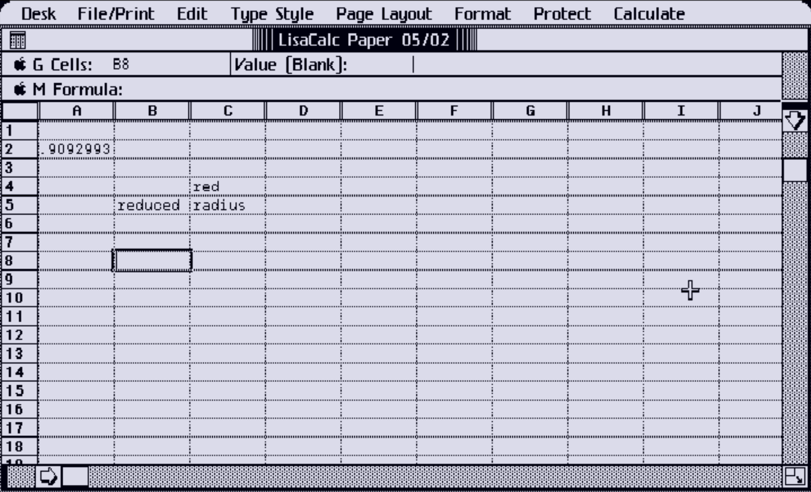
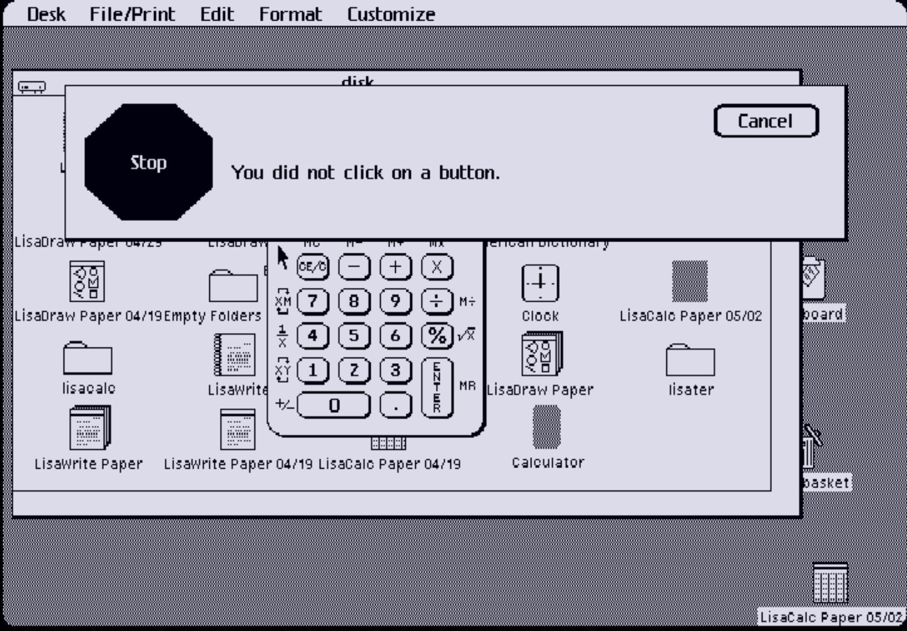
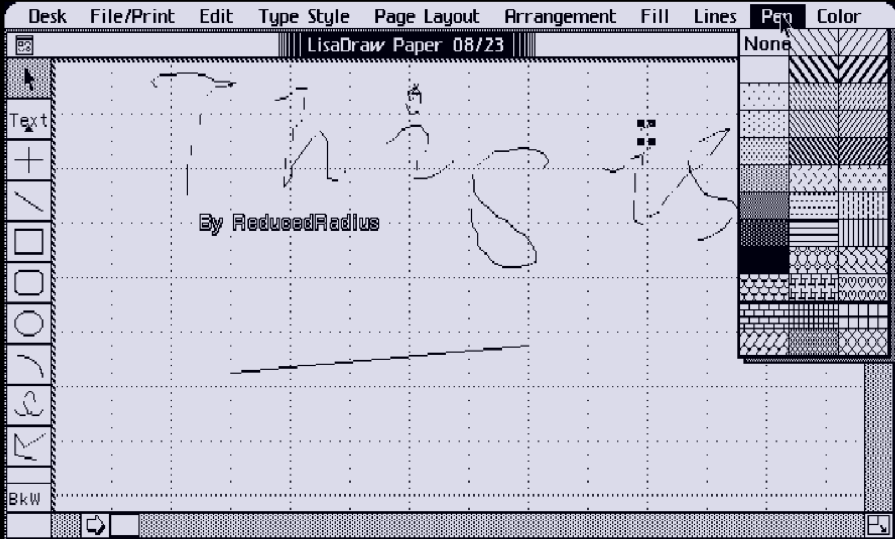
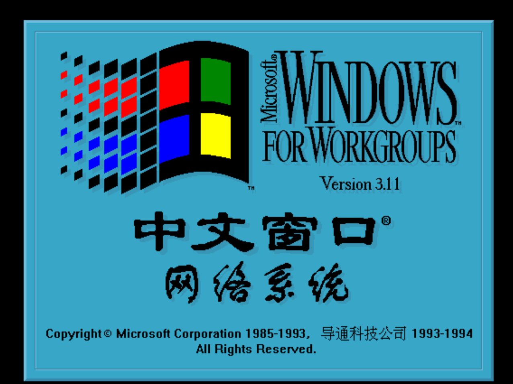

# 本页面部分可运行模拟器说明（摘编自维基百科或其英文版转译）
## Atari TOS（1985-1992）
雅达利TOS随着雅达利520ST在1985年面世。系统运行在Digital Research公司的GEMDOS平台。主要特性包括平面存储器模式、与DOS兼容的文件系统，支持MIDI，以及对SCSI的支持。TOS最早使用软盘驱动，之后则集成于计算机内的ROM芯片上。
在接下来的七年里，从1985年到1992年，随着ST系列的每一代新版本陆续发布。更新包括在光栅端支持更多颜色和更高分辨率，但在GKS支持方面基本与原版相似。1992年，雅达利发布了TOS 4，或称MultiTOS，并推出了他们的最后一款计算机系统Falcon030。结合 MiNT，TOS 4 支持 GEM 中的完整多任务处理功能。
90年代后，随后GEM转为OpenGEM，freeGEM两个项目。

## Apple II(1977-1993)
Apple II是苹果公司制作的第一种普及的微型计算机。它的直系先祖是Apple I——一种有限的、以印刷电路板组成的电脑。
自1977年于西岸电脑展（West Coast Computer Faire）首次发布后，Apple II成为一种成功的个人电脑。直至1993年为止，估计共生产了5－6百万部Apple II（包括约125万部Apple IIGS） 。

## Wine(2008-今)
Wine是一个容许类Unix操作系统在X Window System运行Microsoft Windows程序的软件。由于Windows的DLL为封闭源代码，所以程序员只能由最底层的设计开始，耗费大量的时间来编写和测试，最后达至兼容，这过程是困难且缓慢的。Wine计划在1993年由Bob Amstadt及Eric Youngdale发起，2006年Google积极参与这个计划后，Wine的发展才又恢复起色，最后终于在2008年发布首个稳定版。
截至本文写作时间，已发布Wine11.0（2026年1月）

## Atari 2600（1977-1992）
雅达利于1977年6月4日在消费电子展上展出了雅达利2600，雅达利当时为它起的名字是“Atari Video Computer System”。2600最终于同年9月上市。1983年，美国爆发游戏业大萧条，大量充斥于2600上的劣质游戏，以及雅达利自身都被认为是这场业界市场萧条的重要诱因。在这场游戏业大萧条之下，大量2600游戏机与以《E·T外星人》为首的劣质2600游戏滞销。无奈之下，雅达利只能将这些滞销的产品运往垃圾场掩埋。大萧条当年雅达利亏损5.36亿美元。公司由此一蹶不振，次年再被华纳卖出。到1984年时，除雅达利与动视外的厂商对2600的软件开发也基本全线停止。1990年，雅达利发售了他们为2600开发的最后一款游戏《Klax》。两年后，1992年1月1日，雅达利2600在发售14年后停产。

>附注：1983年美国游戏业大萧条
>1983年美国游戏业大萧条（英语：Video game crash of 1983）是美国电子游戏历史在1983年至1984年间的市场萧条。
> 此次大萧条终结第二世代的电视游戏市场，使部分北美地区开发电视游戏的公司被迫宣告破产，对美国和加拿大的游戏市场影响深远。
>普遍认为原因：大量廉价的家用电脑冲击当时正在初生期的美国游戏业，其中以Commodore 64的口号最为突出：“Why buy your child a video game and distract them from school when you can buy them a home computer that will prepare them for college?”（当你可以买一台能为子女准备上大学的家用电脑时，您为何会买一台令子女玩物丧志的游戏机呢？）不少研究人员也研究过这种现象：人们为什么会失去原来购买游戏机的欲望，转而购买价格差不多的家用电脑呢？
> 大量仓促开发出来的劣质游戏。如基于当时很火红的一部电影E.T.而为Atari 2600主机开发的游戏，以及著名的Pac-Man这款游戏的雏形，当时游戏开发，制造商无法控制，当销售遇冷时，以至于游戏机推出都出现困难。
>当时的电子游戏销售方式类似于玩具，通常电子游戏由游戏制作商委托的公司或商店售卖。如果一款产品销量不好，这个委托商就会将这款游戏返还给制作商，再索取一个新游戏销售，如此循环直至游戏卖出。这种销售模式——一些人坚持认为——是这次崩盘的主要原因。

## Classic Mac OS（1984-2001）
所指的是苹果公司从1984年至2001年间为麦金塔系列电脑所开发的一系列操作系统，始于System 1，终结于Mac OS 9。本页面仅提供Mac6.0.7，7.1的中文版本。(运行内存8,192KB)

软盘映像来源：https://winworldpc.com/

# 其他模拟器截图
因不是什么模拟器都可以直接置于本站中，也不是什么大型系统皆能够存在本站，故展示下列模拟器的图片以供参阅。

## LisaEm（基于CSharp）

 
LisaCalc
 

 
You didn't click on a button:
 

 
画图（LisaDraw）
(另注意：Color指打印的颜色，并非显示的颜色)
 

## DOSBOX
Windows for workgroups 3.11中文特色版本
 

 （by 导通科技公司）